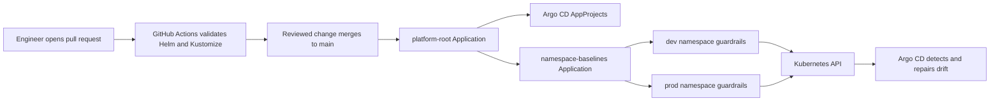

# Azure Platform Lab GitOps

This repository is the desired-state source for Kubernetes configuration in the
`aks-azplab-lab` cluster. Argo CD continuously compares the YAML stored here
with the live cluster and corrects drift.

The lab uses one shared AKS worker node because the subscription currently has
a four-vCPU regional quota. The repository models production delivery and
governance patterns, but it does not claim production availability: failure or
maintenance of the single worker node affects Argo CD, `dev`, and `prod`.

## Ownership and repository boundaries

- `azure-platform-lab-infra` owns Azure resources: AKS, networking, ACR, Key
  Vault, storage, identities, Azure RBAC, budgets, and Terraform state.
- `azure-platform-lab-gitops` owns the desired Kubernetes platform state:
  Argo CD bootstrap, Argo projects, namespaces, policies, quotas, and future
  application release declarations.
- `azure-platform-lab-apps` owns application source code, Dockerfiles, tests,
  image builds, and application Helm packaging.
- The platform team owns this repository. Application teams propose GitOps
  changes through pull requests; production-pattern changes require review.

Terraform must not deploy application manifests, and application CI must not
run `kubectl apply` against the cluster. This separation keeps infrastructure,
deployment intent, and application code independently auditable.

## End-to-end reconciliation flow



There are two operating phases:

1. **Bootstrap:** an administrator installs Argo CD with Helm and applies
   `bootstrap/root-application.yaml` once. Argo CD cannot install itself before
   its CRDs and controllers exist.
2. **Normal operation:** changes merge to `main`; Argo CD pulls them and
   reconciles the cluster automatically. Manual edits to managed resources are
   reverted by self-healing.

## Repository tree

```text
.
|-- .github/
|   |-- CODEOWNERS
|   `-- workflows/validate.yml
|-- bootstrap/
|   |-- argocd/
|   |   |-- Chart.yaml
|   |   |-- Chart.lock
|   |   `-- values.yaml
|   `-- root-application.yaml
|-- clusters/
|   `-- lab/
|       |-- kustomization.yaml
|       |-- projects.yaml
|       `-- namespace-baselines.yaml
|-- platform/
|   `-- namespaces/
|       |-- kustomization.yaml
|       |-- dev/
|       |   |-- kustomization.yaml
|       |   |-- namespace.yaml
|       |   |-- limits.yaml
|       |   |-- quota.yaml
|       |   |-- rbac.yaml
|       |   `-- network-policies.yaml
|       `-- prod/
|           |-- kustomization.yaml
|           |-- namespace.yaml
|           |-- limits.yaml
|           |-- quota.yaml
|           |-- rbac.yaml
|           `-- network-policies.yaml
|-- docs/bootstrap-argocd.md
|-- .editorconfig
|-- .gitattributes
|-- .gitignore
|-- LICENSE
`-- README.md
```

## File-by-file reference

### Repository-level files

| File | Purpose | Why it is required |
|---|---|---|
| `README.md` | Architecture and operating model for this repository. | Makes the intended ownership, workflow, security boundaries, and limitations reviewable. |
| `LICENSE` | MIT license for the repository. | States how the repository content may be reused. It has no cluster effect. |
| `.editorconfig` | Standardizes UTF-8, LF endings, two-space indentation, final newlines, and whitespace handling. | Prevents editor-specific formatting churn and malformed YAML indentation. |
| `.gitattributes` | Normalizes text files to LF line endings. | Keeps Windows and Linux contributors and GitHub runners consistent. |
| `.gitignore` | Excludes downloaded Helm dependencies and temporary files. | `charts/` is reproducibly downloaded from `Chart.lock`; committing the archive would duplicate third-party artifacts. |

### `.github`

| File | Purpose | Why it is required |
|---|---|---|
| `.github/CODEOWNERS` | Assigns the repository, cluster declarations, and `prod` policy files to `@akhtarmoin07`. | GitHub branch protection can require approval from the responsible platform owner. CODEOWNERS alone does not enforce approval; the branch rule must require it. |
| `.github/workflows/validate.yml` | Builds, lints, and renders the Argo Helm chart and renders both Kustomize trees. | Pull requests fail before merge if dependencies cannot resolve or Kubernetes configuration cannot render. It validates desired state but does not connect to or deploy into AKS. |

The workflow performs these operations:

1. Checks out the proposed Git commit.
2. Installs the pinned Helm CLI.
3. Registers the official Argo Helm repository.
4. Downloads the dependency described by `Chart.lock`.
5. Runs `helm lint` and `helm template`.
6. Installs `kubectl` and runs `kubectl kustomize` for the cluster root and
   namespace baselines.

### `bootstrap/argocd`

This directory is a small wrapper Helm chart around the official Argo CD chart.
The wrapper lets the platform team pin a version and keep lab-specific values in
Git without copying the upstream chart.

| File | Purpose | Why it is required |
|---|---|---|
| `Chart.yaml` | Declares the local `platform-argocd` chart and its dependency on official `argo-cd` chart `10.2.1`. `appVersion` records Argo CD `3.4.5`. | Pins what will be installed and provides a controlled place for platform-specific packaging. Chart version and application version are separate concepts. |
| `Chart.lock` | Records the exact resolved dependency and digest. | Makes CI and administrator installations resolve the same upstream chart. Update it deliberately with `helm dependency update`. |
| `values.yaml` | Overrides upstream defaults for this one-node lab. | Keeps Argo CD private and constrains its resource consumption. |

`bootstrap/argocd/charts/` is a generated, Git-ignored working directory. Helm
places the downloaded `argo-cd-10.2.1.tgz` archive there during dependency
builds. `Chart.lock`, rather than the downloaded archive, is the tracked record
of the resolved dependency.

Important settings in `values.yaml`:

- `crds.install: true` installs the `Application`, `AppProject`, and related
  custom resource definitions needed by Argo CD.
- `crds.keep: true` prevents Helm uninstall from automatically deleting those
  CRDs and all custom resources stored under them.
- JSON/info logging is machine-friendly and suitable for later aggregation.
- Argo network policies are enabled, while chart-wide default-deny ingress is
  left off during bootstrap to avoid accidentally blocking required components.
- The controller, server, repository server, Redis, and ApplicationSet
  controller each run one replica with small requests and limits because the
  cluster has one node.
- Dex and notifications are disabled to save capacity. Microsoft Entra SSO and
  notifications can be added later.
- The Argo CD server uses `ClusterIP`; it does not provision a paid public load
  balancer or expose the UI directly to the internet.

### `bootstrap/root-application.yaml`

This is the one-time bridge from imperative bootstrap to declarative GitOps. It
creates the `platform-root` Argo CD `Application` in the `argocd` namespace.

Its important fields are:

- `repoURL`, `targetRevision: main`, and `path: clusters/lab` tell Argo CD which
  Git repository, branch, and directory represent the cluster root.
- `server: https://kubernetes.default.svc` targets the same cluster in which
  Argo CD runs.
- `automated.prune` removes objects that were deliberately removed from Git.
- `automated.selfHeal` restores objects changed manually in the cluster.
- `CreateNamespace=false` prevents Argo CD from silently creating unmanaged
  destination namespaces.
- `PruneLast=true` applies replacements before deleting obsolete resources.
- `ServerSideApply=true` lets the Kubernetes API server manage field ownership.
- The resources finalizer makes deletion of this Application cascade to its
  managed resources. Deleting the root Application is therefore destructive and
  must be reviewed carefully.

### `clusters/lab`

This directory describes one target cluster. A future cluster would receive its
own directory, for example `clusters/staging` or `clusters/production`, without
mixing its release declarations with this lab.

| File | Purpose | Why it is required |
|---|---|---|
| `kustomization.yaml` | Renders `projects.yaml` and `namespace-baselines.yaml` as one cluster-root package. | This is the exact path watched by `platform-root`. |
| `projects.yaml` | Creates the `platform`, `dev`, and `prod` Argo CD `AppProject` security boundaries. | An AppProject restricts which repositories, clusters, namespaces, and resource kinds an Application may target. |
| `namespace-baselines.yaml` | Defines a child Argo CD Application that watches `platform/namespaces`. | Separates the root orchestration layer from the actual namespace policy package. |

`projects.yaml` uses sync wave `-1`, while `namespace-baselines` uses wave `0`.
Argo therefore creates the projects before it tries to create an Application
that refers to the `platform` project.

Project boundaries are intentionally different:

- `platform` trusts only this GitOps repository, can target all namespaces, can
  create cluster-scoped `Namespace` objects, and can manage namespace-scoped
  policy resources.
- `dev` trusts the apps and GitOps repositories but can deploy only to `dev`.
- `prod` trusts the same repositories but can deploy only to `prod`.
- `orphanedResources.warn: true` reports resources in a project destination that
  are not owned by an Argo Application.

An AppProject is an Argo CD deployment boundary. It is not a replacement for
Kubernetes NetworkPolicy, Kubernetes RBAC, or Azure RBAC.

### `platform/namespaces`

The top-level `kustomization.yaml` composes the `dev` and `prod` directories.
Each environment directory contains the same categories of control, with
stricter defaults in production where appropriate.

| File | Object(s) produced | Responsibility |
|---|---|---|
| `platform/namespaces/kustomization.yaml` | Combined dev/prod Kustomize package | Makes both environment baselines one Argo CD source. |
| `dev/kustomization.yaml` and `prod/kustomization.yaml` | Environment-specific rendered package | Selects the five policy files and assigns their namespace. |
| `dev/namespace.yaml` and `prod/namespace.yaml` | `Namespace` | Creates the environment boundary and Pod Security labels. |
| `dev/limits.yaml` and `prod/limits.yaml` | `LimitRange` | Supplies default per-container requests and limits. |
| `dev/quota.yaml` and `prod/quota.yaml` | `ResourceQuota` | Caps aggregate namespace consumption and object counts. |
| `dev/rbac.yaml` and `prod/rbac.yaml` | Two `Role` objects and one `RoleBinding` | Defines developer/viewer permissions and binds platform administrators. |
| `dev/network-policies.yaml` and `prod/network-policies.yaml` | Two `NetworkPolicy` objects | Denies traffic by default and restores required DNS access. |

#### `kustomization.yaml`

Each environment Kustomization sets its namespace and lists the five manifests
that form the namespace baseline. This prevents individual files from being
forgotten during rendering and ensures namespaced resources land in the correct
environment.

#### `namespace.yaml`

Creates the namespace and applies environment and Pod Security Admission labels:

- `dev` enforces the Kubernetes `baseline` policy and warns/audits against the
  stricter `restricted` policy. Developers can see what would fail in prod.
- `prod` enforces, audits, and warns at `restricted`. Future containers must run
  with restricted-compatible security contexts.

#### `limits.yaml`

Creates a `LimitRange`. If a container omits CPU or memory settings, Kubernetes
adds the configured default request and limit.

- A **request** is the capacity used by the scheduler when placing a pod.
- A **limit** is the maximum capacity the container may consume.
- CPU above the limit is throttled; exceeding a memory limit can cause an OOM
  kill.

The defaults stop an unconfigured container from claiming unbounded resources on
the shared node. Explicit Helm values can override them within the ResourceQuota.

#### `quota.yaml`

Creates a namespace-wide `ResourceQuota`. Each namespace is limited to:

- `750m` requested CPU and `1500m` total CPU limits;
- `1536Mi` requested memory and `3Gi` total memory limits;
- 12 pods, 8 services, and 3 persistent volume claims.

Quota is a ceiling, not a reservation. Unused `dev` quota does not reserve CPU
for `dev`, and quotas cannot protect either namespace from failure of the shared
node.

#### `rbac.yaml`

Contains three native Kubernetes RBAC objects:

- `application-developer` is a namespace Role for operating common application,
  service, and batch resources. It deliberately excludes Secret and RBAC access.
- `application-viewer` is a read-only namespace Role and excludes Secret access.
- `platform-administrators` binds the known platform Entra group object ID to the
  built-in namespace `admin` ClusterRole.

Creating a Role alone grants nobody access. The developer and viewer Roles are
prepared for future team-specific RoleBindings or service accounts. The AKS
cluster also has Azure RBAC for Kubernetes authorization enabled; human Entra
access should additionally be represented by namespace-scoped Azure role
assignments in the infrastructure repository. The existing platform group has
cluster-level Azure access from Terraform.

#### `network-policies.yaml`

Contains two Cilium-enforced NetworkPolicies:

- `default-deny` selects every pod and denies ingress and egress unless another
  policy explicitly allows it.
- `allow-dns` permits UDP and TCP port 53 traffic only to CoreDNS pods in
  `kube-system`, allowing service-name resolution.

Future UI, backend, database, ingress, Azure APIs, and image-dependent outbound
traffic require explicit allow policies. Namespace separation by itself does not
block network traffic; these policies create the actual network boundary.

### `docs/bootstrap-argocd.md`

Contains the operator runbook for validating and installing/upgrading the Argo
CD Helm release, verifying its pods and services, and applying the root
Application. It is separate from this conceptual README so operators have a
short command-focused procedure during an incident or rebuild.

## Three different authorization layers

| Layer | Controls | Example in this repository |
|---|---|---|
| Azure RBAC for AKS | Which Entra users/groups can call the Kubernetes API and at what Azure/namespace scope. | Platform administrators are assigned through Terraform in the infrastructure repository. |
| Kubernetes RBAC | Permissions for users, groups, and service accounts inside Kubernetes. | `Role` and `RoleBinding` resources in each namespace. |
| Argo CD AppProject | What an Argo Application may deploy, from which repository, and to which destination. | `dev` Applications cannot target `prod`; `prod` Applications cannot target `dev`. |

These layers complement each other. Passing one layer does not automatically
grant permissions in the others.

## Isolation provided by this lab

| Control | Protects against | Does not protect against |
|---|---|---|
| Namespace | Name collisions and accidental cross-environment targeting | Worker-node failure |
| ResourceQuota and LimitRange | One namespace consuming unlimited declared capacity | Host-level CPU or memory failure |
| Pod Security Admission | Unsafe container privilege settings | Application vulnerabilities |
| NetworkPolicy | Unapproved pod-to-pod and outbound connections | Traffic allowed by a future broad policy |
| RBAC | Unauthorized Kubernetes API operations | Network traffic and node failure |
| AppProject | GitOps deployment to the wrong repository or namespace | Direct access granted outside Argo CD |
| Pull-request review and CODEOWNERS | Unreviewed desired-state changes | Changes if branch protection is not enabled |

## Bootstrap and normal operation

Follow the command-focused runbook in [`docs/bootstrap-argocd.md`](docs/bootstrap-argocd.md).
The high-level order is:

1. Confirm the current `kubectl` context is `aks-azplab-lab`.
2. Build, lint, and render the pinned Helm chart.
3. Install Argo CD into the `argocd` namespace.
4. Verify every Argo CD pod is healthy.
5. Apply `bootstrap/root-application.yaml` once.
6. Verify the root and namespace-baseline Applications are `Synced` and
   `Healthy`.
7. Make all subsequent managed changes through reviewed Git pull requests.

Rollback is normally a Git revert. Argo CD then reconciles the previous desired
state. Avoid deleting Applications directly: their finalizers and pruning policy
can cascade deletion to managed resources.

## Current scope and next steps

Implemented now:

- pinned, resource-constrained Argo CD bootstrap;
- root app-of-apps reconciliation;
- platform/dev/prod AppProjects;
- `dev` and `prod` namespace baselines;
- quotas, limits, Pod Security, RBAC definitions, and default-deny networking;
- pull-request validation and ownership metadata.

Planned after bootstrap verification:

1. Create separate Entra developer and production operator groups.
2. Add namespace-scoped Azure RBAC assignments through Terraform.
3. Build UI, backend, and database images in the apps repository.
4. Package the applications with Helm.
5. Add environment-specific Argo Applications and controlled dev-to-prod image
   promotion.
6. Add ingress, secret retrieval through workload identity/Key Vault, monitoring,
   alerts, backup exercises, and failure runbooks.

   

